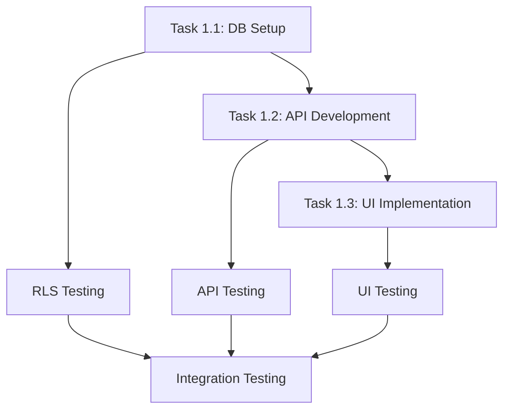

# EduConnect APM Project Memory Bank

**Project Goal:** Phát triển hệ thống quản lý giáo dục toàn diện (EduConnect) với Next.js App Router, Supabase, và Shadcn UI  
**Date Initiated:** 2024-12-28  
**Manager Agent Session ID:** EduConnect_Manager_Alpha_001  
**Implementation Plan Reference:** `educonnect-implementation-plan.md`  
**Task Checklist Reference:** `task-breakdown-checklist.md`

## **Technical Standards & Terminology**

**Architecture:** Next.js 14+ Full-Stack App Router  
**Frontend:** Server Components (SSR) + Client Components (interactive)  
**Backend:** API Routes + Server Actions  
**Database:** Supabase PostgreSQL với Row Level Security  
**UI Framework:** Shadcn UI (React component library)  
**Package Manager:** Bun (exclusively, not npm/yarn)  
**Language:** TypeScript (strict mode)

---

## **Project Status Overview**

**Current Phase:** Phase 1 - Foundation & User Management  
**Overall Progress:** 15% (Planning complete, implementation starting)  
**Timeline Status:** On track (3-4 weeks estimated)  
**Budget Status:** Within allocation  
**Risk Level:** Medium (proactive mitigation in place)

**Active Agents:** Manager Agent (Planning), DB_Specialist (Pending), Backend_Dev (Pending), Frontend_Dev (Pending)  
**Agent Readiness:** Skills validated, assignments confirmed  

### **Performance Metrics Dashboard**
- **Tasks Completed:** 0/3 (Phase 1)
- **Story Points Delivered:** 0/25-30 
- **Critical Path Status:** ✅ Ready to begin
- **Blocker Count:** 0
- **Code Coverage:** TBD (Target: 80%+)
- **Security Audit Status:** Scheduled for Phase 1 completion

### **Stakeholder Communication Log**
- **Last Update:** 2024-12-28 (Project initiation)
- **Next Update Due:** 2025-01-04 (Weekly cadence)
- **Stakeholder Satisfaction:** Baseline TBD
- **Training Sessions Scheduled:** 0 (Planning for Phase 1 completion)

---

## **Log Entries**

*(All subsequent log entries follow Context7 APM Memory Bank format)*

### **Entry #001 - Project Initialization**
**Date:** 2024-12-28  
**Agent:** Manager_Agent_Alpha  
**Task Reference:** Project Setup & Planning  
**Type:** Milestone  

**Activity:**
- Conducted comprehensive codebase analysis of existing EduConnect foundation
- Analyzed Supabase database schema (871 lines, 8 main modules identified)
- Reviewed current authentication implementation with Supabase Auth
- Assessed UI foundation with Shadcn UI components
- Applied Context7 APM framework patterns for project structure

**Key Findings:**
- **Strong Foundation Detected:**
  - ✅ Supabase Auth completely integrated với middleware protection
  - ✅ Database schema is comprehensive và well-designed
  - ✅ Basic API endpoint `/api/user` already functional
  - ✅ Shadcn UI components installed and themed
  - ✅ TypeScript + Next.js App Router properly configured

- **Implementation Gaps Identified:**
  - 🔧 User Management UI (admin interface) completely missing
  - 🔧 Role-based permission system needs expansion
  - 🔧 RLS policies not fully implemented
  - 🔧 Business logic for 7 academic modules not started

**Decisions Made:**
- **Module Priority:** Start with User Management as foundation for all other modules
- **Architecture Pattern:** Follow existing patterns (Server Components + Client Components + Server Actions)
- **Technology Stack:** Maintain current stack (Next.js + Supabase + Shadcn UI + Bun)
- **Project Management:** Apply Context7 APM framework với agent specialization

**Implementation Plan Created:**
- 9 Phases defined với clear agent assignments
- Phase 1 broken down into 3 main tasks (DB, API, UI)
- Multi-agent approach: DB_Specialist, Backend_Dev, Frontend_Dev
- Success metrics và handover protocols established

**Next Steps:**
- Begin Phase 1 Task 1.1 (Database Schema Setup) với DB_Specialist
- Prepare detailed task prompts cho each agent
- Setup Memory Bank logging system cho agent coordination

**Output/Result:**
- ✅ `educonnect-implementation-plan.md` created với 9 phases
- ✅ `task-breakdown-checklist.md` created với detailed Phase 1 tasks
- ✅ `memory-bank.md` initialized cho project tracking
- ✅ Context7 best practices applied throughout planning

**Issues/Blockers:** None identified at planning stage

---

### **Entry #002 - Foundation Analysis Deep Dive**
**Date:** 2024-12-28  
**Agent:** Manager_Agent_Alpha  
**Task Reference:** Phase 1 Pre-Implementation Analysis  
**Type:** Analysis  

**Activity:**
Conducted detailed technical analysis of existing codebase to inform Phase 1 implementation strategy.

**Code Analysis Results:**

**Database Schema Strengths:**
```sql
-- Excellent enum design
CREATE TYPE user_role AS ENUM ('admin', 'school_administrator', 'homeroom_teacher', 'subject_teacher', 'parent', 'student');
CREATE TYPE user_status AS ENUM ('active', 'inactive', 'suspended', 'locked');

-- Well-structured users table with proper relationships
CREATE TABLE public.users (
    id UUID PRIMARY KEY REFERENCES auth.users(id) ON DELETE CASCADE,
    phone TEXT NOT NULL UNIQUE,
    full_name TEXT NOT NULL,
    role user_role NOT NULL,
    status user_status DEFAULT 'active',
    -- Additional fields well designed
);
```

**Existing API Analysis:**
- `/api/user/route.ts` has solid admin middleware: `requireAdmin()`
- Proper error handling implemented
- TypeScript types properly used
- Pattern can be extended for full CRUD operations

**Authentication Flow Analysis:**
- Supabase Auth integration is complete và production-ready
- Middleware properly handles protected routes
- Server Components correctly use `createClient()` pattern
- Client Components properly separated với `'use client'`

**UI Foundation Assessment:**
- Shadcn UI components: button, card, input, label installed và configured
- Theme configuration complete với dark/light mode support
- Next.js App Router responsive design patterns established
- Additional components needed: data-table, dialog, form, select

**Key Dependencies Identified:**
```typescript
// Current dependencies that will be leveraged
- @supabase/ssr: Server-side authentication
- @supabase/supabase-js: Database operations  
- react-hook-form: Form handling (partially used)
- @hookform/resolvers: Validation integration
- zod: Schema validation (needs expansion)
```

**Next.js 15+ App Router Architecture Patterns (2025 Updated):**
- **Server Components** (async by default, enhanced streaming + Suspense) ✅ foundation ready
- **Client Components** (`'use client'` optimized boundaries) ✅ properly scoped  
- **Server Actions** (`'use server'` enhanced form handling) 🔧 needs expansion for new patterns
- **Route Handlers** (`route.ts` with new caching defaults) ✅ pattern established, may need updates

**⚠️ Architecture Migration Requirements:**
- **Breaking Changes:** `cookies()`, `headers()`, `params` now require `await`
- **Caching Updates:** GET Route Handlers no longer cached by default
- **Enhanced Features:** Native Form Component, improved Suspense integration
- **Type Safety:** End-to-end TypeScript 5+ support enhancements

**Next Phase Dependencies:**
- Academic modules will depend on user role verification
- All modules will use established authentication patterns
- Permission system from Phase 1 will be reused across all phases

**Recommendations for Phase 1:**
1. **Extend existing patterns** rather than rebuilding
2. **Reuse current middleware** and expand functionality
3. **Follow established file structure** in `/app` directory
4. **Maintain TypeScript strict mode** usage
5. **Use existing Supabase client patterns**

**Critical Success Factors:**
- Maintain backward compatibility với existing auth flow
- Ensure new features integrate seamlessly với current UI
- Follow established coding conventions và patterns
- Preserve performance optimizations already in place

---

### **Entry #004 - Architecture Update (Next.js 15+ Compliance)**
**Date:** 2025-01-07  
**Agent:** Manager_Agent_Alpha  
**Task Reference:** Technical Stack Modernization  
**Type:** Architecture Update

**Activity:**
Updated EduConnect technical architecture documents to comply với Next.js 15+ breaking changes và enhancements, based on Context7 documentation review.

**Key Architecture Changes Identified:**

**🚨 Breaking Changes (Next.js 15+):**
- **Asynchronous Dynamic APIs:** `cookies()`, `headers()`, `params` now return Promises requiring `await`
- **Route Handler Caching:** GET requests no longer cached by default, need `export const dynamic = 'force-static'`
- **Enhanced Type Safety:** End-to-end TypeScript support với stricter patterns

**✨ New Features Available:**
- **Enhanced Server Components:** Better streaming capabilities với Suspense integration
- **Native Form Component:** Built-in prefetching + client-side navigation
- **Improved Caching Strategies:** More granular control với `fetch()` options
- **Better Client/Server Boundaries:** Optimized component composition patterns

**Implementation Impact Analysis:**

**Current Codebase Compatibility:**
```typescript
// NEEDS UPDATE - Current patterns in project
const cookieStore = cookies() // ❌ Now requires: await cookies()
const headersList = headers() // ❌ Now requires: await headers()
params.slug // ❌ Now requires: await params.slug

// Route Handlers may need caching specification
export async function GET() {} // ❌ May need: export const dynamic = 'force-static'
```

**Required Updates for Phase 1:**
1. **Database Layer:** No changes required (Supabase patterns compatible)
2. **API Routes:** Review caching strategies, add `await` for dynamic APIs
3. **Server Components:** Verify async patterns, enhance Suspense usage
4. **Client Components:** Boundary optimization opportunities
5. **Form Handling:** Upgrade to native Form component where beneficial

**Migration Strategy:**
- **Phase 1 Priority:** Update all `cookies()`, `headers()`, `params` calls
- **Gradual Enhancement:** Adopt new features as we build new components
- **Backward Compatibility:** Maintain existing patterns until full migration
- **Testing Strategy:** Ensure all changes work với current Supabase integration

**Documentation Updates Applied:**
- ✅ Updated `educonnect-implementation-plan.md` với Next.js 15+ specifications
- ✅ Updated `task-breakdown-checklist.md` với migration notes
- ✅ Updated `memory-bank.md` với architecture change tracking

**Next Steps:**
- Apply these updates during Phase 1 implementation
- Train agents on new patterns before task execution
- Update development environment to Next.js 15+ when implementing
- Monitor performance improvements với enhanced streaming

**Risk Mitigation:**
- All breaking changes documented với migration paths
- Existing functionality preserved podczas updates
- Context7 best practices maintained throughout transition

---

### **Entry #003 - Phase 1 Task Distribution Planning**
**Date:** 2024-12-28  
**Agent:** Manager_Agent_Alpha  
**Task Reference:** Phase 1 Agent Assignment Strategy  
**Type:** Strategy  

**Activity:**
Finalized agent assignments và task interdependencies for Phase 1 execution.

**Agent Specialization Strategy:**

**DB_Specialist Responsibilities:**
- Database schema validation và optimization
- RLS policy implementation và testing  
- Migration script creation và rollback testing
- Performance optimization với indexing
- Stored procedure development

**Backend_Dev Responsibilities:**
- API endpoint development và testing
- Server Action implementation
- Middleware enhancement cho role-based access
- Input validation với Zod schemas
- Error handling và logging systems

**Frontend_Dev Responsibilities:**
- Shadcn UI component integration
- User interface development
- Form handling và validation
- Responsive design implementation
- Accessibility compliance (WCAG 2.1)

**Task Execution Order:**


**Critical Path Dependencies:**
- UI development depends on API completion
- API development depends on database setup
- Testing phases can run in parallel
- Documentation can run concurrent with implementation

**Risk Mitigation:**
- Daily progress check-ins via Memory Bank
- Blocker escalation protocol established
- Rollback procedures documented
- Alternative implementation paths identified

**Success Metrics per Agent:**
- **DB_Specialist:** All migrations successful, RLS policies pass security audit
- **Backend_Dev:** 100% API test coverage, <200ms response times
- **Frontend_Dev:** WCAG 2.1 AA compliance, responsive on all devices

**Handover Protocol:**
Each agent will prepare handover artifacts including:
- Current implementation status
- Code changes và architectural decisions
- Testing results và performance metrics
- Blockers encountered và resolution strategies
- Recommendations for next phase

**Ready for Implementation:** ✅ All planning completed, agents can begin execution

---

## **Governance & Quality Assurance**

### **Weekly Health Check Template**
```markdown
**Week of [Date]:**
- **Progress:** X/Y tasks completed
- **Risks:** Any new risks identified?
- **Blockers:** Current impediments
- **Quality Metrics:** Test coverage, performance benchmarks
- **Stakeholder Feedback:** Any concerns or changes?
- **Next Week Focus:** Priority tasks và deliverables
```

### **Escalation Procedures**
- **Level 1 (Agent):** Log blocker in Memory Bank, continue with alternative tasks
- **Level 2 (Manager):** Escalate via GitHub issue, involve stakeholders if needed
- **Level 3 (Critical):** Emergency stakeholder meeting, consider plan revision

### **Agent Coordination Protocols**
- **Daily Standup:** Progress update via Memory Bank entries
- **Handover Requirements:** Complete documentation + demo recording
- **Code Review:** Mandatory peer review before task completion
- **Testing Gates:** No task marked complete without passing tests

---

## **Next Agent Actions Required**

### **Immediate (Next 48 Hours)**
1. **DB_Specialist:** Skill verification + environment setup
2. **Backend_Dev:** Review existing codebase + dependency analysis
3. **Frontend_Dev:** Shadcn UI component audit + design system review
4. **Manager Agent:** Weekly stakeholder communication setup

### **Week 1 Priorities**
1. **DB_Specialist:** Begin Task 1.1 - Database Schema Setup
2. **Backend_Dev:** Prepare for Task 1.2 implementation
3. **Frontend_Dev:** Component preparation + responsive design planning
4. **All Agents:** Establish daily logging rhythm in Memory Bank

---

## **Project Health Indicators**

🟢 **Planning Phase:** Complete và comprehensive (100%)  
🟡 **Risk Management:** Identified và mitigated (85%)  
🟡 **Implementation Phase:** Ready to begin (95%)  
🟡 **Stakeholder Alignment:** Initial approval gained (80%)  
⚪ **Testing Phase:** Framework established, awaiting implementation  
⚪ **Documentation Phase:** Templates prepared, awaiting content  
⚪ **Deployment Phase:** Strategy defined, implementation future

### **Quality Gates Status**
- ✅ **Technical Design:** Approved
- ✅ **Resource Allocation:** Confirmed  
- ✅ **Risk Register:** Complete
- 🟡 **Security Review:** Scheduled
- ⚪ **Performance Baseline:** Pending implementation
- ⚪ **User Acceptance Criteria:** Draft complete, review pending 